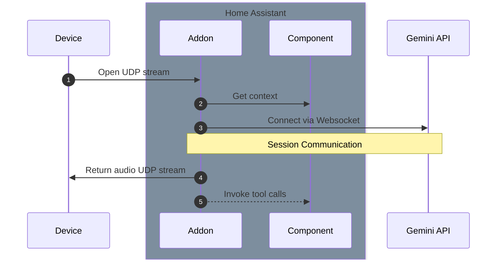
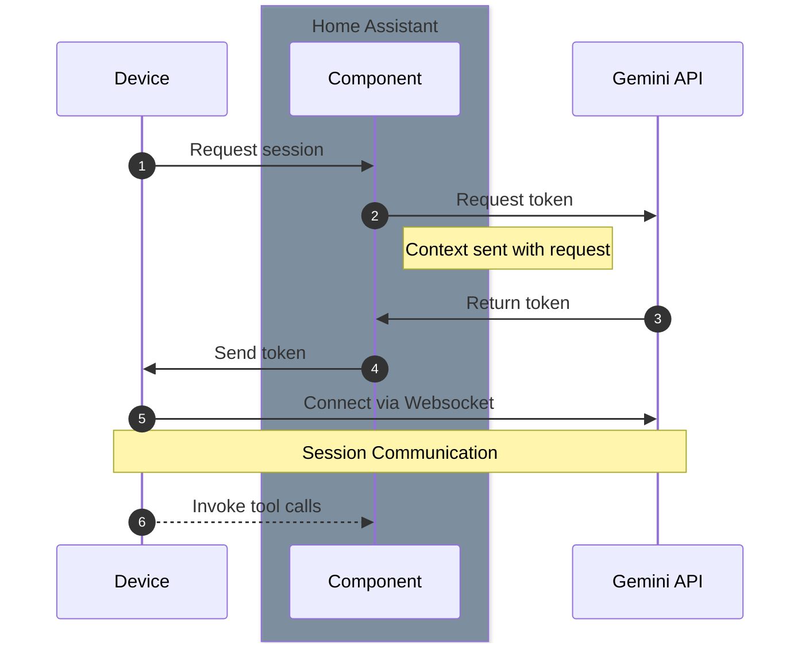

# Architecture Overview

The current architecture consists of two parts: a home assistant custom component and a home assistant add-on. The custom component is responsible for fetching configuration information from home assistant and sending that to the add-on. The add on proxies audio between the device and the cloud, additionally it provides the final context and handles tool calls.

## Bridge (addon):

## Direct connect:

[docs](https://ai.google.dev/gemini-api/docs/ephemeral-tokens)

