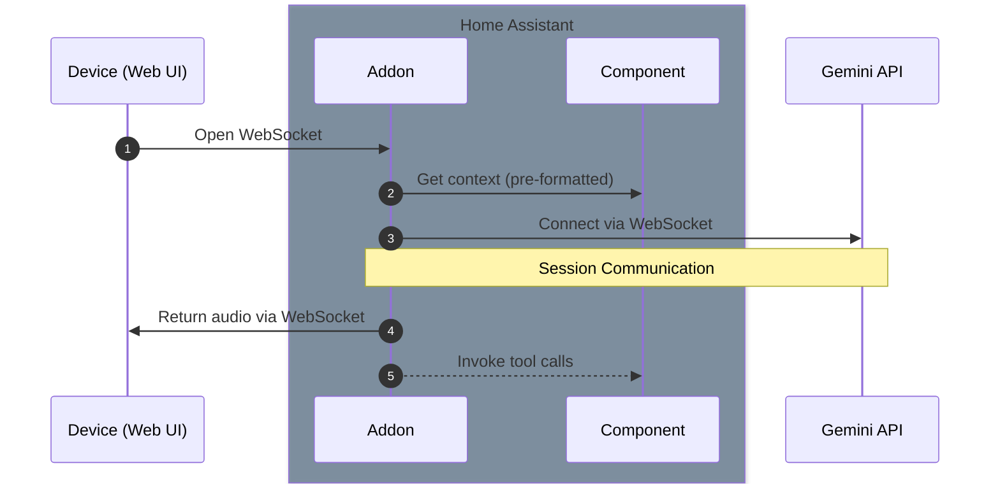
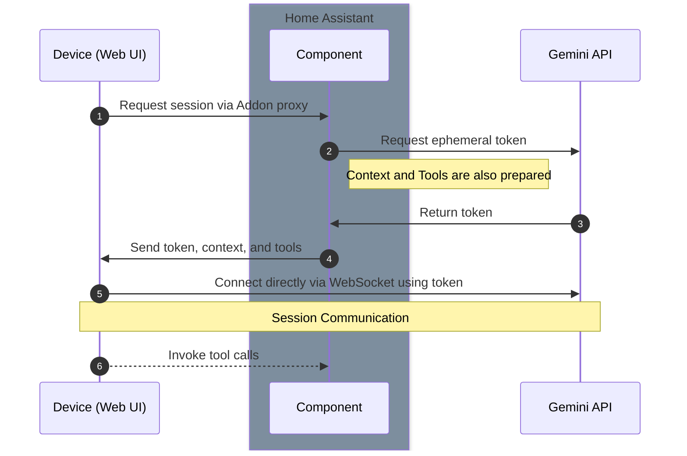

# Architecture Update: Bridge vs. Direct Connect

This document outlines the two operational modes for the Gemini Tool Bridge integration: "Bridge" mode and "Direct Connect" mode. The web interface in the addon can be used to test both scenarios.

## Bridge Mode (Default)

In this mode, the Home Assistant addon acts as a full proxy for audio and tool calls.

**Flow:**
1.  The client device (like the addon's web UI) establishes a WebSocket connection to the addon.
2.  The addon requests the formatted device context from the Home Assistant custom component.
3.  The addon establishes its own session with the Gemini API.
4.  Audio from the client is proxied through the addon to the Gemini API.
5.  Audio responses from Gemini are proxied back through the addon to the client.
6.  Tool calls from Gemini are executed by the addon, which communicates with Home Assistant.

## Direct Connect Mode

This mode allows a client device to connect directly to the Gemini API, reducing latency and offloading the proxying work from the addon. This is achieved using short-lived ephemeral tokens for security.

**Flow:**
1.  From the web UI, the user selects "Direct Connect" and provides their Google AI API Key.
2.  The web UI sends a request to the addon's `/session` endpoint.
3.  The addon proxies this request to the Home Assistant custom component's `/api/gemini_live/session` endpoint.
4.  The custom component:
    *   Generates the formatted device context.
    *   Fetches the available Home Assistant tools.
    *   Uses the provided API key to request an **ephemeral token** from the Gemini API.
5.  The custom component returns the ephemeral token, the context, and the tool definitions to the addon, which forwards them to the web UI.
6.  The web UI now has everything it needs to connect **directly** to the Gemini API's WebSocket endpoint, using the ephemeral token for authentication.
7.  Tool calls from the client are sent back to Home Assistant for execution.

## Centralized Context Generation

To avoid code duplication, the logic for fetching entities from Home Assistant and formatting them into the text-based context for the Gemini model now resides **exclusively** within the custom component (`custom_components/gemini_tool_bridge/context.py`).

*   When the addon needs context (for "bridge" mode), it makes a `POST` request to `/api/gemini_live/entities` with a `Content-Type` of `text/plain` and receives the pre-formatted string.
*   When a client needs the raw entity data (like the web UI), it can make a `POST` request to the same endpoint with a `Content-Type` of `application/json` to get the structured data.

This approach ensures consistency and simplifies maintenance.
